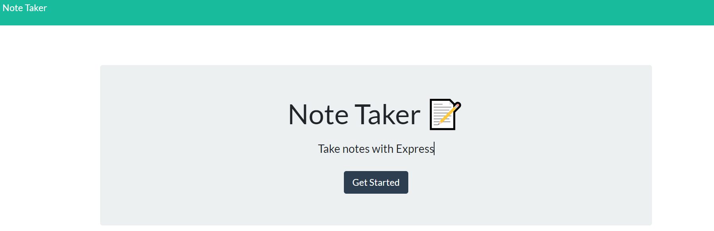

# Express.js: Note Taker

## Description

```
AS A small business owner
I WANT to be able to write and save notes
SO THAT I can organize my thoughts and keep track of tasks I need to complete
```

## Table of Contents
- [Usage](#usage)
- [Credits](#credits)
- [License](#license)
- [Questions](#Questions)
- [Deployed app](#Deployed-app)

## Usage

```
GIVEN a note-taking application
WHEN I open the Note Taker
THEN I am presented with a landing page with a link to a notes page
WHEN I click on the link to the notes page
THEN I am presented with a page with existing notes listed in the left-hand column, plus empty fields to enter a new note title and the note’s text in the right-hand column
WHEN I enter a new note title and the note’s text
THEN a Save icon appears in the navigation at the top of the page
WHEN I click on the Save icon
THEN the new note I have entered is saved and appears in the left-hand column with the other existing notes
WHEN I click on an existing note in the list in the left-hand column
THEN that note appears in the right-hand column
WHEN I click on the Write icon in the navigation at the top of the page
THEN I am presented with empty fields to enter a new note title and the note’s text in the right-hand column
```

## Credits

This project was posbile with the knowledge acquired at Tecnologico de Monterrey University Coding Bootcamp https://bootcamp.tec.mx/coding/

## License

[](https://opensource.org/licenses/Apache-2.0)
© Licensed under the Apache License 2.0

## Questions
Contact me:

- GitHub: [stamm2911](https://github.com/stamm2911)

- Email: edstamm29@gmail.com


## Deployed-app 

https://obscure-cove-25493.herokuapp.com/

